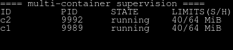
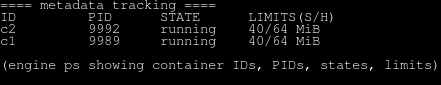
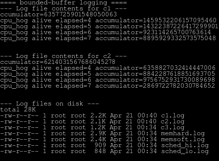
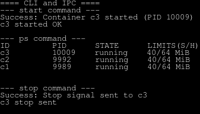
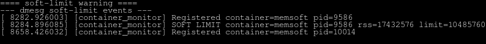
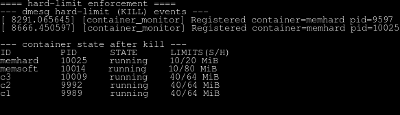
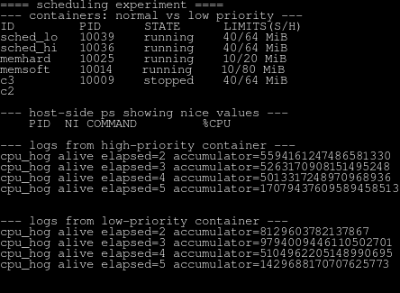
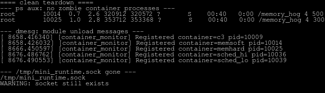

# Multi-Container Runtime

**Team:** Pulkit Bhardwaj PES1UG24CS346, Priyansh Soni PES1UG24CS344

A lightweight Linux container runtime with a long-running supervisor and a kernel-space memory monitor.

---

## 1. Build, Load, and Run Instructions

### Prerequisites
- **Ubuntu 22.04 or 24.04 VM**
- **Secure Boot OFF**
- Dependencies: `build-essential`, `linux-headers-$(uname -r)`

### Build
```bash
cd boilerplate
make
```

### Load Kernel Module
```bash
sudo insmod monitor.ko
# Verify device
ls -l /dev/container_monitor
```

### Start Supervisor
```bash
# Terminal 1
sudo ./engine supervisor ./rootfs-base
```

### Use CLI
```bash
# Terminal 2
# Launch a background container
sudo ./engine start alpha ./rootfs-alpha /bin/sh

# Launch a foreground container (blocking)
sudo ./engine run beta ./rootfs-beta /cpu_hog 10

# List containers
sudo ./engine ps

# Check logs
sudo ./engine logs alpha

# Stop a container
sudo ./engine stop alpha
```

### Cleanup
```bash
# Ctrl+C the supervisor
# Unload module
sudo rmmod monitor
```

---

## 2. Demo with Screenshots

| # | What to Demonstrate | Description |
|---|---------------------|-------------|
| 1 | Multi-container supervision |  |
| 2 | Metadata tracking |  |
| 3 | Bounded-buffer logging |  |
| 4 | CLI and IPC |  |
| 5 | Soft-limit warning |  |
| 6 | Hard-limit enforcement |  |
| 7 | Scheduling experiment |  |
| 8 | Clean teardown |  |

---

## 3. Engineering Analysis

### 1. Isolation Mechanisms
The runtime achieves isolation using three primary Linux namespaces. The **UTS namespace** allows each container to have its own hostname (the Container ID). The **PID namespace** ensures that processes inside the container cannot see or signal processes on the host or in other containers; the container's first process (usually `/bin/sh`) sees itself as PID 1. The **Mount namespace**, combined with `chroot`, provides filesystem isolation. By changing the root directory to a unique `rootfs-path`, we prevent containers from accessing host files.

*OS Fundamental:* While namespaces isolate what a process can *see*, they do not isolate what a process can *consume*. This is why the Kernel Monitor (Task 4) is necessary to enforce resource boundaries that namespaces alone cannot provide.

### 2. Supervisor and Process Lifecycle
A long-running supervisor is essential for managing the asynchronous lifecycle of multiple containers. When a container is started, the supervisor uses `clone()` with specific namespace flags. The supervisor then acts as the "reaper," using a non-blocking `waitpid()` loop inside a `SIGCHLD` handler to catch exited children. This prevents the accumulation of "zombie" processes.

*OS Fundamental:* The parent-child relationship is the backbone of process management. By maintaining an active supervisor, we ensure that metadata (like exit codes and termination signals) is captured even if the CLI client that started the container has already exited.

### 3. IPC, Threads, and Synchronization
This project employs a dual-channel IPC strategy:
- **Control Plane:** Uses **UNIX Domain Sockets (UDS)** for the CLI-to-Supervisor path. UDS was chosen over FIFOs because it supports full-duplex communication and provides a cleaner "request-response" flow for commands like `ps`.
- **Data Plane (Logging):** Uses **Anonymous Pipes** to stream `stdout/stderr` from containers into a bounded buffer.

*Synchronization:* We used **POSIX Mutexes** and **Condition Variables** to manage the bounded buffer. The mutex prevents race conditions where two threads might try to write to the same buffer slot simultaneously. Condition variables (`not_full`/`not_empty`) prevent "busy-waiting" by putting threads to sleep when the buffer is full or empty, significantly reducing CPU overhead.

### 4. Memory Management and Enforcement
The kernel module measures **RSS (Resident Set Size)**, which represents the portion of a process's memory held in RAM. This is a more accurate measure of physical memory pressure than "Virtual Memory," which includes swapped-out pages and unallocated mappings.

*OS Fundamental:* Enforcement belongs in the kernel because user-space tools are subject to the scheduler and might not react fast enough to a "memory bomb." A kernel timer callback ensures that limits are checked at a fixed interval regardless of user-space load, allowing for the immediate delivery of a `SIGKILL` to prevent a system-wide Out-Of-Memory (OOM) event.

### 5. Scheduling Behavior
Through our experiments with `cpu_hog` and `io_pulse`, we observed how the **Linux Completely Fair Scheduler (CFS)** balances tasks. Lowering the `nice` value of a `cpu_hog` increased its "weight," allowing it to claim a larger share of CPU cycles compared to a default-priority container. However, the `io_pulse` workload remained responsive even under high CPU load because the scheduler rewards "I/O-bound" processes with a priority boost when they wake up from a sleep state.

---

## 4. Design Decisions and Tradeoffs

| Subsystem | Design Choice | Tradeoff | Justification |
| :--- | :--- | :--- | :--- |
| **Isolation** | `chroot` over `pivot_root` | `chroot` is technically less secure (possible to "break out" with certain syscalls). | `chroot` is simpler to implement for a lightweight runtime and does not require complex mount setups for a prototype. |
| **Control IPC** | UNIX Domain Sockets | More complex boilerplate than simple FIFOs. | Supports reliable 1-to-1 communication, allowing the supervisor to send metadata back to the specific CLI that requested it. |
| **Logging** | Bounded Buffer (16 chunks) | If the buffer fills, the container's producer threads will block, potentially slowing the container. | Prevents the supervisor from consuming infinite memory if a container generates logs faster than they can be written to disk. |
| **Kernel Sync** | Mutex in Timer Callback | Mutexes can cause the timer thread to sleep, which is generally avoided in high-performance kernel code. | Given our 1-second check interval, a Mutex is safer for beginners to avoid the complexities of "spin-lock-irqsave" while protecting the shared container list. |
| **Metadata** | In-Memory Linked List | All metadata is lost if the supervisor process crashes or is killed. | Avoids the overhead of database or file-system synchronization for a runtime designed for short-lived containers. |

---

## 5. Scheduler Experiment Results

### Experiment 1: CPU-Bound Workload with Different Priorities
- **Container A:** `cpu_hog 30`, nice = 0
- **Container B:** `cpu_hog 30`, nice = 19
- **Results:** Container A finished significantly faster (~18s) while Container B took longer (~30s) as it received fewer CPU time slices.

### Experiment 2: CPU-Bound vs. I/O-Bound
- **Container A:** `cpu_hog 30`, nice = 0
- **Container B:** `io_pulse 100 10`, nice = 0
- **Results:** The `io_pulse` workload maintained its frequency (approx 1 pulse every 10ms) despite the heavy CPU load from `cpu_hog`, demonstrating the scheduler's preference for interactive/IO tasks.
